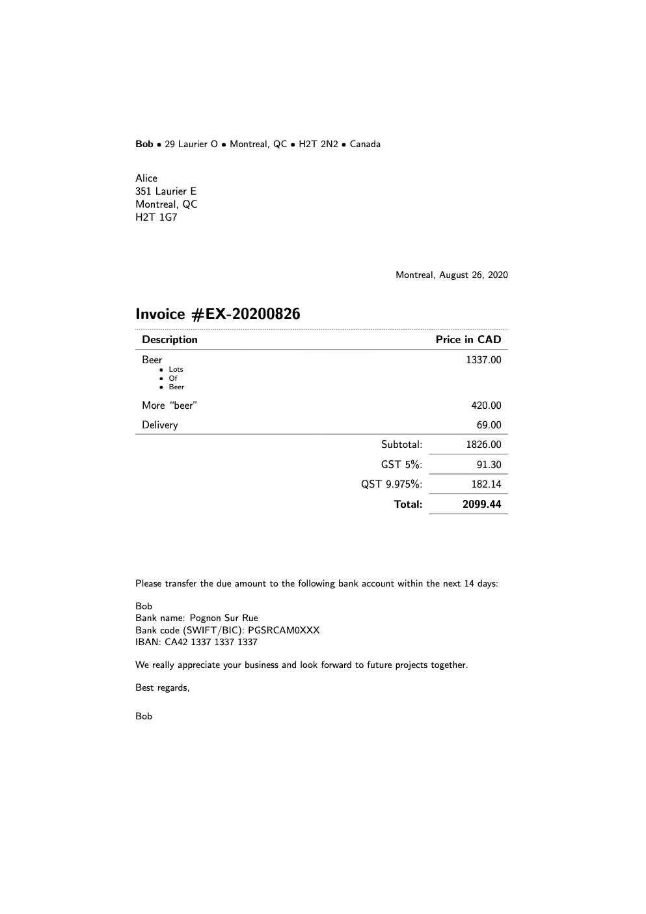

# Invoicr

> Automated LaTeX invoicing system.

Based on [mrzool/invoice-boilerplate] and adapted for Quebec.

[mrzool/invoice-boilerplate]: https://github.com/mrzool/invoice-boilerplate

## Overview



## Dependencies

* Pandoc
* LaTeX with the following extra packages: `spreadtab`, `tabularx`, `hhline`, `arydshln` and `enumitem`

On Arch Linux:

```sh
pacman -S pandoc texlive-core texlive-latexextra
```

On macOS:

```
brew install pandoc
brew cask install basictex
sudo tlmgr update --self
sudo tlmgr install titlesec spreadtab arydshln enumitem xstring
sudo tlmgr paper a4
```

## Usage

Create a `whatever.md` following `example.md` format, the run
`make whatever.pdf`.

## How it works

Pandoc allows to use a template file, here `invoice.tex`, which its own
language allowing variable interpolation, conditions and loops.

Those variables are read from the YAML front matter of the input file,
here `whatever.md`. The fact the file here is Markdown is irrelevant,
since there's no body other than the YAML front matter, it's essentially
a convenient way to store the Pandoc metadata in a file instead of
passing it as CLI arguments.

Using Pandoc's templating language, the LaTeX source is populated with
the invoice contents, and rendered as PDF.

## Suggestion of organization

Clone this repo, then store your invoices as `<client>/<invoice-nr>.md`,
and run `make <client>/<invoice-nr>.pdf` to generate the PDF.

If you want to keep history of your invoices source and/or PDF, feel
free to fork this repo instead as a private repo and commit/push your
invoices.

## How I took the example screenshot

Opened the PDF in Firefox, then ran the following in the inspector console:

```js
document.body.innerHTML = ``
```
